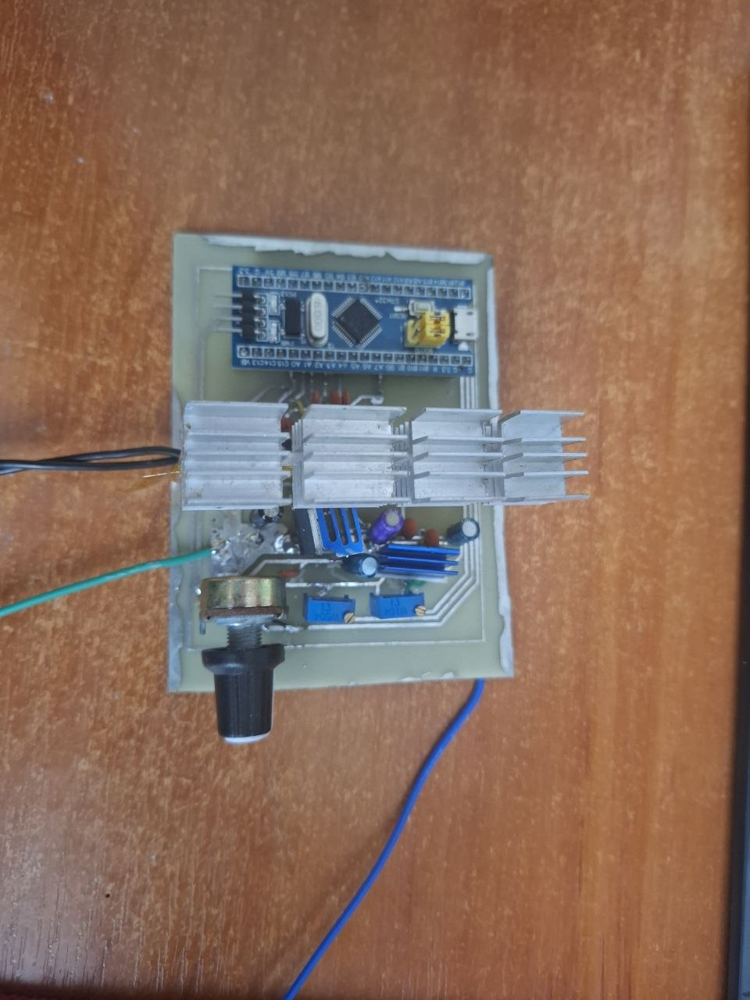
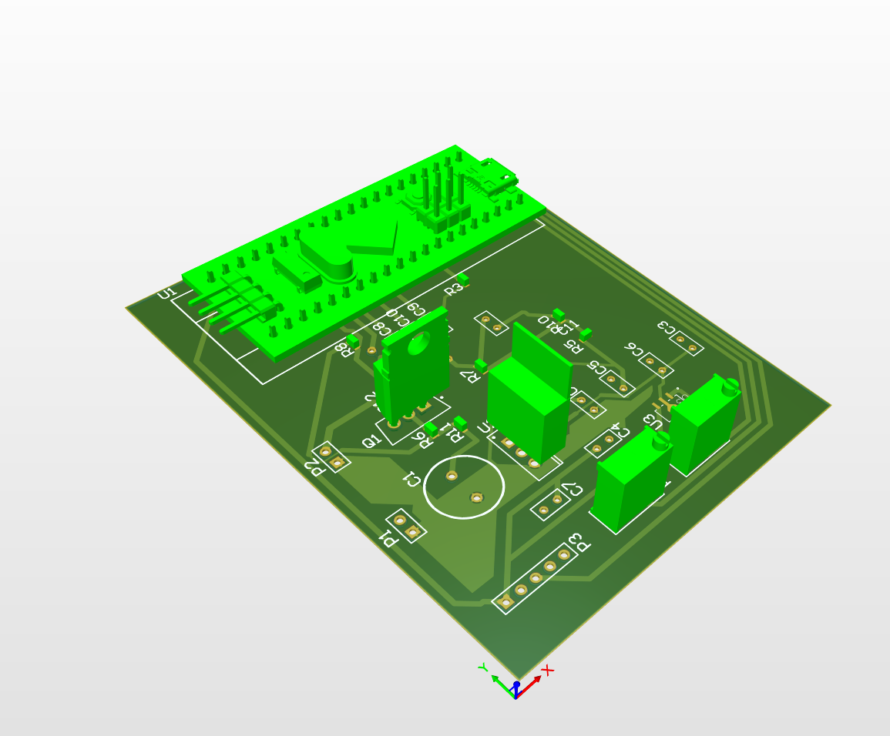

# STM32 Sensorless DC Motor Speed Controller (BEMF Feedback)

<p align="center">
  
</p>

[cite_start]A closed-loop sensorless brushed DC motor speed regulator using **Back-Electromotive Force (BEMF)** sensing and a digital **PID control algorithm**[cite: 362]. Built around the **STM32F103C8** microcontroller with high-speed **SEGGER RTT** real-time telemetry.

---

## ⚡ Key Highlights

* **Sensorless Speed Feedback**: Measures Back-EMF during PWM off-cycles to estimate motor RPM without external optical/magnetic encoders.
* **Closed-Loop PID Regulation**: Real-time RPM stabilization under varying mechanical loads with anti-windup protection.
* **On-the-Fly Tuning**: Live adjustment of PID gains ($K_i$, $K_d$) and target speed via dedicated analog potentiometers.
* **Protection & Smooth Dynamics**: Soft-start speed ramping and undervoltage lockout via continuous motor bus ($V_{MOT}$) monitoring.
* **Non-blocking Telemetry**: High-speed real-time logging via **SEGGER RTT** (J-Link) for control loop inspection without UART latency overhead.

---

## 🛠️ System Overview

### 1. Hardware Architecture (Altium Designer)
Dedicated signal conditioning circuitry with precision resistor dividers for BEMF voltage sensing and power rail filtering.

<p align="center">
  
</p>

* **MCU**: STM32F103C8T6 (ARM Cortex-M3).
* **Power Stage**: H-Bridge motor driver with flyback protection.
* [cite_start]Altium Designer schematics, PCB layouts, and manufacturing Gerbers are located in [`/Hardware`](./Hardware)[cite: 369].

---

### 2. Embedded Software (PlatformIO / C++)
* **ADC Sampling**: Synchronized ADC conversions for accurate BEMF and $V_{MOT}$ readings.
* [cite_start]**PWM Generation**: High-frequency timer-driven PWM with configurable duty cycle steps[cite: 370, 371].
* **Control Loop**: Discrete PID controller computing real-time error corrections.

[cite_start]Source code, drivers, and PlatformIO configuration are located in [`/Firmware`](./Firmware)[cite: 373].

---

## 📂 Repository Structure

```text
├── Hardware/   # Altium Designer schematics, PCB layout, Gerbers, BOM [cite: 373]
├── Firmware/   # PlatformIO source code (C++), drivers, RTT config [cite: 373]
└── docs/       # PCB photos, Altium 3D renders, and signal waveforms [cite: 373]
